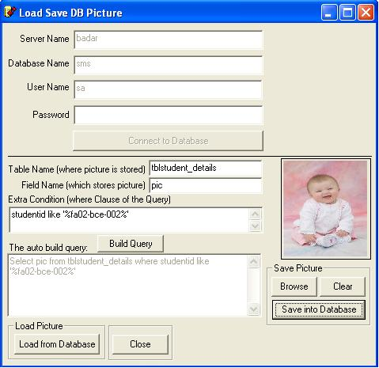



## Saving and Retrieving Pictures from SQL\-Server 2000 through VB6 Code

### Description

It is a simple application that can connect to any database of MS-SQLServer 2000, and can get and store pictures in the specified tables of that database.
 
### More Info
 
First to connect with the SQL Server, four information need to be provided. Server Name, Database Name, User Name and Password. Then Press "Connect to Database" button.

After successful connection, provide information to build a successful query. The information required are: Table Name (where picture is stored), Field Name (of that table which holds pictures in binary form), and any "Extra condition" to be placed in WHERE Clause of the query.

"Build Query" button will show the actual query built on your provided information.

These information are required to Load and Save Pictures in Database.

Displays the picture stored in the database.

or Save the browsed picture in the database.

             |
---                |---
**Submitted On**   |2007-09-26 14:02:18
**By**             |[Instant Programmer](https://github.com/Planet-Source-Code/PSCIndex/blob/master/ByAuthor/instant-programmer.md)
**Level**          |Beginner
**User Rating**    |4.3 (13 globes from 3 users)
**Compatibility**  |VB 6\.0
**Category**       |[Databases/ Data Access/ DAO/ ADO](https://github.com/Planet-Source-Code/PSCIndex/blob/master/ByCategory/databases-data-access-dao-ado__1-6.md)
**World**          |[Visual Basic](https://github.com/Planet-Source-Code/PSCIndex/blob/master/ByWorld/visual-basic.md)
**Archive File**   |[Saving\_and2085169292007\.zip](https://github.com/Planet-Source-Code/instant-programmer-saving-and-retrieving-pictures-from-sql-server-2000-through-vb6-code__1-69413/archive/master.zip)

